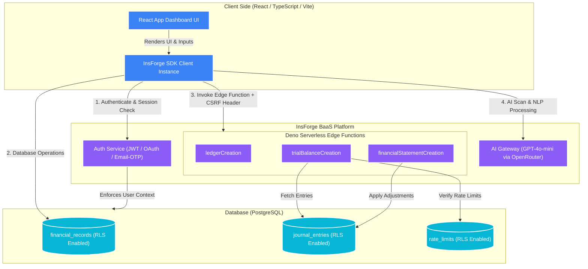

# 📊 Balansify — Working Capital & Financial Ratio Analyzer

<div align="center">

[](https://balansify.insforge.site/)
[](https://react.dev/)
[](https://www.typescriptlang.org/)
[](https://vite.dev/)
[](https://insforge.dev)
[](https://opensource.org/licenses/MIT)

</div>

---

## 🚀 Experience the Live App

> [!IMPORTANT]
> ### 🔗 **[ACCESS BALANSIFY ONLINE — HTTPS://BALANSIFY.INSFORGE.SITE/](https://balansify.insforge.site/)**
> *Calculate ratios, scan financial statements with AI, input double-entry ledgers, and execute realtime serverless accounting pipelines in a click.*

---

**Balansify** is a professional, high-fidelity corporate finance platform designed to compute liquidity, solvency, turnover, and profitability ratios while maintaining a robust, double-entry bookkeeping pipeline. Powered by **InsForge (BaaS)**, Balansify integrates AI-powered financial scanning, natural-language ledger entries, and automated financial statement generation powered by edge functions.

---

## ✨ Features Breakdown

### 1. 📈 Financial Ratios & Analysis (ICAI Standards)
Computes industry-standard financial metrics and evaluates them against reference benchmarks:
- **Liquidity**: Current Ratio (Ideal 2:1), Quick / Acid-Test Ratio (Ideal 1:1)
- **Solvency**: Debt-to-Equity (Ideal < 2:1), Interest Coverage Ratio (Ideal > 3.0)
- **Efficiency**: Inventory Turnover, Fixed Assets Turnover, Return on Investment (ROI)
- **Profitability**: Net Profit Margin

### 2. 🤖 AI Financial Statement Scanner
Paste unstructured financial transcripts, balance sheet drafts, or earnings reports and watch GPT-4o-mini (orchestrated via InsForge AI) automatically parse corporate variables and populate the ratio calculator.

### 3. 🗣️ NLP Double-Entry Ingestion
Input accounting entries using natural language commands. For instance:
> *"Started corporate operations with a cash capital injection of 800,000"* or *"Paid office rent of 25,000 in cash"*
The NLP engine extracts the exact Debit and Credit accounts, dates, and amounts, staging them for your confirmation before writing.

### 4. ⚡ Realtime Accounting Pipelines
Deno Serverless Edge Functions compile entries on the fly into complete downstream pipelines:
* **Ledgers (`ledgerCreation`)**: Automatically groups transactions into standard Debit/Credit T-accounts.
* **Trial Balance (`trialBalanceCreation`)**: Builds a self-balancing double-entry Trial Balance sheet.
* **Financial Statements (`financialStatementCreation`)**: Adjusts entries for closing stock, depreciation, and accruals, rendering a Trading & Profit & Loss Statement alongside a structured Balance Sheet.

---

## 🏛️ System Architecture



---

## ⚙️ Local Development Setup

Follow these instructions to run the project locally.

### Prerequisites
- [Node.js](https://nodejs.org/) (v18 or higher recommended)
- `npm` or `yarn`

### 1. Clone & Install Dependencies
```bash
git clone https://github.com/Kreshiv/balansify.git
cd balansify
npm install
```

### 2. Configure Environment Variables
Create a `.env.local` file in the root directory:
```env
VITE_INSFORGE_BASE_URL=https://hk36kn9p.us-east.insforge.app
VITE_INSFORGE_ANON_KEY=your-anon-key-here
```

### 3. Launch Development Server
```bash
npm run dev
```
Open [http://localhost:5173](http://localhost:5173) in your browser to interact with the project.

---

## 🔒 Security Architecture Highlights

### Client-Side CSRF Computation
Balansify secures serverless calls by hashing the user's active session token using `SHA-256` and transmitting it via the `X-CSRF-Token` header.
```typescript
export async function computeClientCsrfToken(token: string | null): Promise<string> {
  if (!token) return '';
  const msgUint8 = new TextEncoder().encode(token);
  const hashBuffer = await window.crypto.subtle.digest('SHA-256', msgUint8);
  const hashArray = Array.from(new Uint8Array(hashBuffer));
  return hashArray.map(b => b.toString(16).padStart(2, '0')).join('');
}
```

### Database Rate Limiting
To protect computing resources, the Deno Edge Functions check rate limits inside a dedicated Postgres table before executing heavy computational flows:
```sql
CREATE TABLE IF NOT EXISTS rate_limits (
  id UUID PRIMARY KEY DEFAULT gen_random_uuid(),
  key TEXT NOT NULL UNIQUE,
  last_request TIMESTAMP WITH TIME ZONE DEFAULT now(),
  request_count INTEGER DEFAULT 1
);
```

---

## 👨‍💻 Author & Contact Information

Balansify is designed, built, and maintained by **Kreshiv Kewalramani**. Feel free to connect for collaborations, feedback, or general inquiries:

* **Name**: Kreshiv Kewalramani
* **LinkedIn**: [linkedin.com/in/kreshiv-kewalramani](https://www.linkedin.com/in/kreshiv-kewalramani/)
* **Email**: [kreshiv.kewalramani@gmail.com](mailto:kreshiv.kewalramani@gmail.com)

---

<div align="center">
  <sub>Built with ❤️ using React 19, Vite 8, Tailwind CSS, and InsForge BaaS.</sub>
</div>
